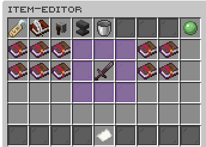
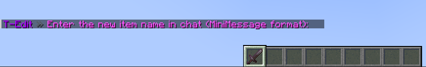
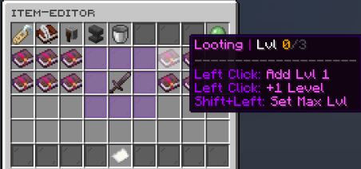
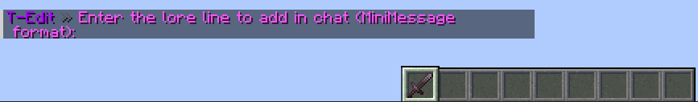

<h1 align="center">T-Edit ✨</h1>

<div align="center">

*Enchanting made easier!*



</div>

---

## ✨ Overview

T-Edit is a modern, feature-rich GUI-based item editor that allows server administrators and players to modify items with ease and elegance. With a sleek purple-themed interface and intuitive controls, T-Edit brings the power of advanced item manipulation into an accessible package.

---

## 🌟 Features

- **Beautiful GUI Interface** – Clean, modern design with consistent purple theme  
- **Comprehensive Item Editing** – Edit names, lore, enchantments, and more  
- **Advanced Enchantment System** – Add, remove, and adjust enchantment levels  
- **Permission-Based Access** – Granular permission system for control  
- **Fully Configurable** – Customize every aspect of the plugin  
- **MiniMessage Support** – Use gradient colors and text formatting  
- **Paginated Enchantments** – Browse all enchantments with ease  

---

## 📥 Installation

1. Download from [GitHub Releases](https://github.com/takedaa83/T-Edit/releases)  
2. Place the `.jar` in the `plugins` folder  
3. Restart your server  
4. Optionally configure in `plugins/T-Edit`  
5. Use `/edit` to get started!  

---

## 🛠️ Commands

| Command          | Description                          | Permission     |
|------------------|--------------------------------------|----------------|
| `/edit`          | Opens the GUI for held item          | `tedit.use`    |
| `/tedit reload`  | Reloads configuration files          | `tedit.reload` |

---

## 🔒 Permissions

### User

- `tedit.use` – Use `/edit`
- `tedit.rename` – Rename items
- `tedit.lore.edit` – Add lore
- `tedit.lore.clear` – Clear lore
- `tedit.repair` – Repair item
- `tedit.duplicate` – Duplicate item

### Enchantments

- `tedit.enchant.base` – Basic enchantment editing  
- `tedit.enchant.bypasslevel` – Ignore vanilla level caps  
- `tedit.enchant.bypassconflict` – Apply conflicting enchantments  
- `tedit.enchant.treasure` – Use treasure enchantments  
- `tedit.enchant.curses` – Use curses  

### Admin

- `tedit.admin` – All admin-level access  
- `tedit.reload` – Reload configurations  

### Wildcard

- `tedit.*` – Grants all permissions  

---

## ⚙️ Configuration

### `config.yml`
```yaml
debug:
  enabled: false

enchantments:
  allow_bypass_level_caps: false
  allow_bypass_conflicts: false
  allow_treasure: true
  allow_curses: true

item-blacklist:
  - "minecraft:barrier"
  - "minecraft:command_block"
```

### `gui.yml`
```yaml
title: "<gradient:#AA00FF:#DD55FF><bold>T-Edit Item Editor</bold></gradient>"
size: 54
```

### `messages.yml`
```yaml
prefix: "<gradient:#AA00FF:#DD55FF>T-Edit <dark_gray>» </dark_gray>"
```

### `sounds.yml`
```yaml
enabled: true
sounds:
  gui_open: BLOCK_CHEST_OPEN
```

---

## 📷 Screenshots

<div align="center">

<br>
<i>Item renaming with MiniMessage support</i><br><br>

<br>
<i>Intuitive enchantment management interface</i><br><br>

<br>
<i>Adding and editing lore with ease</i>

</div>

---

## 💡 Tips & Tricks

- Use MiniMessage for rich formatting:  
  `<gradient:#AA00FF:#DD55FF>Epic Sword</gradient>`
- Use pagination buttons to browse enchantments
- Use permission plugins to assign features by rank

---

## ❓ Troubleshooting

**Command not working?**  
→ Make sure you have the correct permission

**GUI not opening?**  
→ Check you're holding an editable item

**Enchantments not showing?**  
→ Ensure item is enchantable and permission is granted

---

## 🤝 Contributing

1. Fork this repo  
2. Create a branch: `git checkout -b feature/amazing-feature`  
3. Commit: `git commit -m "Add amazing feature"`  
4. Push: `git push origin feature/amazing-feature`  
5. Open a Pull Request 🙌

---

## 📝 License

Licensed under the [MIT License](LICENSE)

---

## 🙏 Acknowledgments

- Bukkit / Spigot / Paper community  
- All testers and contributors  
- Built with ❤️ by Takeda

---

<div align="center">

[](https://discord.gg/your-discord)
[](https://github.com/sponsors/takedaa83)

</div>

---
